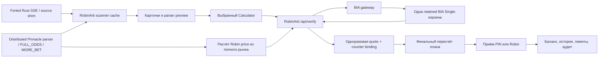

# RobinArb: полная карта продукта, интерфейса и модулей

Дата снимка: 2026-08-13, BIA-only gateway cutover и runtime-сверка 16:28 UTC
Объект аудита: текущий live-код `/srv/robinarb/current` и BIA gateway `/srv/robinarb-bia-gateway` на `dev`.
Формат: логические возможности продукта, а не перечень Python/JavaScript-функций. Документ обновлён после production hardening, снятия пользовательского top-5 actionability gate, оптимизации Calculator → exact-price critical path и полного brand/UX-pass 2026-08-12.

> Это одновременно карта фактической системы и checklist. Метки **Выполнено** описывают уже выложенное состояние. Остальные «изменить/перенести/удалить» остаются предложениями и требуют отдельной проверки зависимостей.

## 0. Что фактически изменено 2026-08-11—13

В production выполнены последовательные безопасные hardening-проходы:

- оставлен один пользовательский betting flow: карточка → Calculator → фактический Donor → PIN или Robin;
- удалены из runtime `Quick PIN`, `Quick Robin`, quick confirmation modal и `PinnaclePricePopup`;
- удалены `Reviews` navigation/route/component; старые URL перенаправляются в Scanner;
- RobinWork всегда включён, пользователь больше не может отключить безопасную выборку;
- `Total` и presets удалены из Calculator UI; единственный режим ввода — фактические donor stake/odds;
- шаг donor odds изменён на `0.001`, поля получили явные accessibility labels;
- карточка больше не называет parser PIN цену «проверенной»: точная BIA Single-цена появляется только в Calculator;
- восстановлен исходный `index.html`, поэтому production frontend снова собирается штатной командой;
- gateway release теперь ищет Single непосредственно в prepared registry, даже если verify-cache исчез;
- gateway гарантирует не более одной retained Single на пару `consumer + intent`, заменяя старую корзину при редкой повторной create;
- gateway `/health` показывает `prepared_single_baskets`, `prepared_single_intents` и `verify_cache_entries`;
- при быстрой смене A → B frontend теперь отменяет HTTP verify A, ждёт фактического завершения его promise и только затем освобождает intent A и запускает B;
- backend сериализует verify/release отдельным lock на каждый calculator `intent_id`, поэтому release не может обогнать ещё выполняющийся verify;
- если upstream verify завершился уже после смены/закрытия Calculator, backend повторно освобождает поздно созданную Single и возвращает `CALCULATOR_SUPERSEDED`;
- удалён недостижимый дублирующий release-блок backend;
- глобальные Forted profile/filters вынесены из Scanner в новую admin-вкладку `Operations`; trader больше не видит и не может случайно менять upstream intake;
- Help в Balance переписан под реальный Donor → BIA/Parser flow, несуществующий video placeholder удалён;
- новые пользователи в Admin создаются с безопасными балансами `0/0`, а не `10000/10000`;
- удалены четыре неиспользуемых frontend API wrapper и мёртвые math/presentation helpers старых Quick/Total flows; соответствующие backend routes сохранены для внешней совместимости;
- добавлены frontend regression-контракт `npm run test:safe-flow` и headless browser-контракт `npm run test:safe-flow-browser`;
- browser-контракт с mock API проверяет trader Scanner, Donor Calculator, быстрое A → B, release A/verify B и admin-only Operations без реального placement;
- BIA transport unit fixture изолирован от live Forted profile epoch, поэтому тест воспроизводим независимо от состояния подключённого feed;
- добавлены gateway-тесты orphan release и same-intent replacement.
- исторический `ps3838-betslip.service` заменён на явно названный `robinarb-bia-gateway.service`;
- из активного gateway entrypoint удалены создание `PS3838Session`, запуск `PinnacleLineWorker`, direct verify/place и маршруты `/sample-selection`, `/balance`, `/relogin`, `/market-margin`, `/clear`;
- `BIA_ONLY_MODE=0` больше не может включить direct transport: BIA-only policy зафиксирована в коде, а legacy `side=pinnacle` fail-closed возвращает `DIRECT_PINNACLE_REMOVED`;
- новый gateway читает отдельный `/etc/robinarb/robinarb-bia-gateway.env`, куда перенесены только BIA credentials и общие BIA rate/TTL settings; Pinnacle login/password/proxy/line-worker settings в runtime env отсутствуют;
- старые betslip/proxy/reverse-tunnel/logout-monitor units остановлены, disabled и masked; listener `:1080` отсутствует;
- direct Pinnacle modules/scripts/session state и прежние service logs вынесены из активного каталога в recoverable backup, а не оставлены рядом с runtime entrypoint;
- top-5 больше не является разрешением на Robin action: любая строка со свежей полной exact parser/Arcadia binding становится actionable;
- внутренний top-N сохранён только как hot-refresh priority при большом потоке и не делит рассчитанные предложения на «можно/нельзя»;
- fallback-table, неполный рынок, stale parser price и verification-block по-прежнему никогда не становятся actionable;
- scanner по-прежнему не создаёт BIA-корзины: массовый account-backed fallback выключен, а медленные источники остаются отдельно ограничены.
- trusted `FULL_ODDS` lookup теперь сохраняет точные `selection_id/odds_id/line_id` в arb и переносит их в следующий Scanner snapshot;
- Calculator обычно отправляет эти идентификаторы прямо в BIA и не ждёт последовательный `MORE_BET`; fallback остаётся только для строк, где parser ещё не доказал точный ID;
- после BIA ответа backend сначала восстанавливает свежую exact Robin quote из короткого структурного cache и не пересчитывает тот же parser market второй раз;
- frontend сохраняет отсутствие overlapping verify requests, но выравнивает их старты до реального интервала около `1.0s`, вычитая время предыдущего запроса;
- mocked browser latency contract проверяет немедленный первый verify, порядок `release A → verify B` и около-1Hz cadence даже при искусственных `300ms` upstream responses.
- до авторизации добавлена полноценная публичная главная: ценность RobinArb, пример вилки, объяснение закрытой arbitrage-only модели, безопасный workflow и ручной запрос доступа;
- продуктовая формулировка зафиксирована прямо в UI: лучшая Robin-цена превращает часть отрицательных Forted + Pinnacle комбинаций в доступные вилки и увеличивает их число более чем на 50%;
- canonical Robin — один мягкий компактный персонаж в сером капюшоне с тонкой салатовой окантовкой и **одним листиком**, а не пером; на главной используются две консистентные позы одного персонажа;
- добавлены две сохраняемые темы: светлая chrome-gray и тёмная graphite; значение хранится в `localStorage` под ключом `robinarb.workspaceTheme` и применяется до React mount без вспышки неверной темы;
- салатовый `#a8f05b` закреплён как семантический цвет доступной Robin-цены, главного CTA, active state и позитивного live status; нейтральные действия остаются серыми;
- навигация workspace очищена от платформозависимых emoji и использует единые моноширинные коды `SC/HI/BA/AD/ST`; те же правила применены к заголовкам History/Balance/Admin и основным Calculator actions;
- мобильный Calculator больше не перекрывается bottom navigation: при открытой выбранной вилке навигация скрывается, внешний leg занимает отдельную строку, PIN и Robin сравниваются рядом, а links/accept actions складываются в предсказуемую сетку 2×2;
- muted-текст светлой темы затемнён до WCAG contrast `4.76:1`; общий `:focus-visible` outline добавлен для ссылок, кнопок, inputs, selects и textarea;
- platform fallback display-шрифта принудительно остаётся тяжёлым (`font-weight: 900`): macOS/Chrome и headless Linux/Android больше не показывают разные по весу заголовки;
- backend, BIA contracts, quote lifecycle и правила приёма в design-pass не менялись.

Проверка после выкладки:

- production Vite build: успешно, 48 modules; итоговые assets `73.17 kB CSS` и `385.18 kB JS` до gzip;
- семь production frontend contract/helper/browser scripts: успешно;
- отдельная visual regression матрица: landing light/dark/mobile, Scanner desktop/mobile, Calculator light/dark/mobile; во всех проверенных viewport нет horizontal overflow;
- keyboard focus contract, theme switch, загрузка двух mascot assets и мобильное скрытие/возврат navigation: успешно;
- Calculator latency/verify/release + RobinArb BIA transport tests: `9 passed`;
- три точечных exact-cache/profile regression-теста в изолированной production-копии: `3 passed`;
- BIA gateway до cutover: `128 passed`, `58 subtests passed`; BIA-only cutover acceptance: `74 passed`, `45 subtests passed`;
- полный исторический RobinArb backend-suite: `880 passed`, `297 subtests passed`, `30 failed`, `1 collection error`; это отдельный накопленный test-debt, а не зелёный acceptance suite этого change set;
- три падения `test_app_api`, наиболее близкие к Calculator/BIA изменению, воспроизведены на backup `server.py` до второго hardening-pass, поэтому текущей гонкой не внесены;
- RobinArb и BIA gateway health: `ok`;
- gateway policy: `bia_only`, direct Pinnacle transport removed; health содержит `direct_pinnacle_removed=true` и `pinnacle_state=removed`;
- корзины в покое после тестов: `prepared_single_baskets=0`, `prepared_single_intents=0`;
- Forted feed после deployment: 30 строк, самая свежая около `0.3s` на момент проверки;
- distributed parser на `secret`: повторный запуск корректно отклонён из-за явного `account suspended` у обоих настроенных browser-parser аккаунтов; после автоматического rollback `DesiredState=stopped`, role-controller, proxy-guard, role-fleet, feed tunnel и aggregator inactive/disabled, parser-порты закрыты;
- публичный `https://robinarb.com/`: HTTP 200; новый landing, обе WebP-позы Robin и theme switch загружаются без browser console warnings/errors; `/api/auth/me` без token корректно отвечает 401.

Recoverable backups:

- первый cleanup: `/srv/robinarb/backups/ux-cleanup-20260811-2045`;
- второй hardening-pass: `/srv/robinarb/backups/ideal-pass-20260811-210250`.
- снятие top-5 actionability gate: `/srv/robinarb/backups/all-exact-robin-20260812-004758`.
- оптимизация Calculator critical path: `/srv/robinarb/backups/calculator-latency-20260812-0100`.
- brand/UX-pass и предыдущий production `dist`: `/srv/robinarb/backups/brand-v2-20260812T151005Z`.
- прежний operator wrapper distributed parser: `/usr/local/sbin/distributed-parser.bak-20260812-auth-failfast` на `secret`.
- BIA-only gateway cutover, retired source/units/logs: `/srv/robinarb-bia-gateway/backups/bia-gateway-cutover-20260813T162034Z` на `dev`.

## 1. Что такое RobinArb сейчас

RobinArb получает вилки от Forted, показывает пользователю внешнее плечо и два варианта нашего плеча:

- `PIN`: принять плечо по текущей исполнимой цене `pin88` из BIA Single-корзины;
- `Robin`: принять то же событие у RobinBet по цене, рассчитанной из полного точного рынка Pinnacle, полученного парсером.

Пользователь сначала самостоятельно ставит внешнее плечо у указанного букмекера. Только после фиксации фактической суммы и цены внешнего плеча RobinArb рассчитывает и принимает наше плечо.

Ключевая продуктовая цель: пользователю должно быть быстрее и понятнее работать в RobinArb, чем вручную сочетать Forted и Pinnacle, но RobinArb не должен принимать PIN по непроверенной цене.

Ключевое продуктовое преимущество сформулировано так:

- RobinArb работает не как второй букмекер для любого трафика, а как закрытый инструмент только для дисциплинированного арбитража;
- пользователь не может брать всю линию Pinnacle, делать произвольные плюсовые одиночные ставки, догонять проигрыш или использовать martingale/dogger-поток;
- более предсказуемый риск позволяет часть преимущества вернуть пользователю в Robin-цене;
- Robin-цена открывает комбинации, которые при обычной цене Pinnacle имели бы отрицательный результат, поэтому доступных вилок становится более чем на 50% больше;
- обещание удобства не отменяет safety: PIN всё равно исполним только после BIA Single, Robin — только после полной exact parser binding, а наше плечо — только после фактического внешнего хеджа.

## 2. Неподвижные правила безопасности

1. Цена из Forted/parser — это быстрый preview, но не доказательство исполнимости PIN.
2. PIN разрешён только по свежей точной строке `pin88` из BIA Single-корзины.
3. Accumulator может показывать leg-цены, но API не подписывает их отдельно: `legs[].price = null`. Они не являются доказательством для PIN.
4. Robin рассчитывается независимо от BIA-корзины — по полному точному рынку parser/FULL_ODDS.
5. Внешнее плечо ставится первым и подтверждается пользователем. Автопринятие нашего плеча до хеджа запрещено.
6. Quote одноразовая, привязана к пользователю, вилке, исходу, рынку, Forted profile epoch и текущему counter-плану.
7. Старая, sticky, replayed, simulation или неполная quote не может маскироваться под свежую BIA Single quote.
8. При смене цены пересчитывается только наше плечо; уже поставленная внешняя ставка остаётся фиксированной.
9. Мультилег без отдельно зафиксированных фактических сумм и цен всех внешних legs остаётся planning-only.
10. Неоднозначный рынок, неполный settlement scope, подозрительный скачок цены или несовпадение идентификаторов блокирует приём.

## 3. Главный поток данных

## 4. Что происходит с BIA-корзиной на самом деле

### 4.1 Это не push-подписка

Сейчас браузер не подписывается на BIA WebSocket/SSE. В доступном BIA API такой подтверждённой подписки нет.

Фактический механизм:

1. Calculator сразу вызывает RobinArb `POST /api/verify`.
2. RobinArb вызывает gateway `POST /verify` с устойчивым `intent_id`.
3. Первый вызов создаёт одну BIA Single-корзину.
4. Следующие вызовы используют тот же `prepared_quote_id` и тот же `betslip_id`.
5. Gateway делает `GET` той же корзины и не чаще чем раз в `0.8s` вызывает её `POST /refresh`.
6. Gateway увеличивает `basket_revision`, продлевает TTL и возвращает текущие price/min/max.
7. Frontend планирует следующий verify только после завершения предыдущего — запросы не перекрываются; задержка до следующего старта равна `max(0, 1s − длительность прошлого запроса)`.

Следовательно:

- новую корзину каждую секунду мы **не создаём**;
- HTTP polling той же корзины всё ещё есть;
- SSE между frontend и RobinArb сократил бы браузерный HTTP-шум, но не отменил бы необходимость gateway читать BIA-корзину;
- внедрять SSE только ради названия «подписка» сейчас мало полезно: главный риск — не транспорт frontend→backend, а точность и жизненный цикл BIA Single.

### 4.2 Интервалы

| Цикл | Текущий интервал | Что делает |
|---|---:|---|
| Calculator exact verify | около 1.0s между стартами, без overlap | Получает новую ревизию выбранной Single-корзины; длительность HTTP больше не прибавляется сверху к каждой секунде |
| BIA basket refresh POST | не чаще 0.8s | Просит BIA обновить retained basket |
| BIA basket GET | на каждом gateway refresh | Читает точную строку `pin88` |
| Prepared quote TTL | 12s, продлевается | Удаляет заброшенную корзину |
| Scanner RobinWork | 0.75s | Обновляет карточки из cache/parser; это единственный пользовательский режим |
| Scanner при pending pricing | 4s | Снижает лишнюю нагрузку |
| Balance | 10s | Обновляет баланс и in-play |
| Bookmaker status idle | 10s | Проверяет активный Forted profile |
| Bookmaker status switching | 2s | Ждёт новый согласованный profile epoch |
| System blocked modal | 15s | Обновляет текущие системные блокировки |

### 4.3 Смена карточки

До первого исправления 2026-08-11 frontend просил release старой корзины, но backend `_release_pinnacle_verify_intent` фактически ничего не отправлял. После первого исправления оставалась более редкая гонка: браузер логически отменял результат verify A, но сам HTTP-запрос не прерывал. Release A мог завершиться раньше, чем медленный verify A успевал создать корзину, после чего поздняя Single A доживала до TTL.

Теперь:

1. карточка и parser preview переключаются визуально сразу;
2. frontend вызывает `AbortController.abort()` для verify A и ждёт settlement фактического request promise;
3. после settlement frontend отправляет release предыдущего `arb_id`;
4. backend действительно вызывает gateway `POST /verify/release` с точным `intent_id`;
5. backend выполняет verify и release одного intent под одним per-intent async lock;
6. gateway удаляет только корзину этого пользователя/client/arb;
7. если ответ verify пришёл после удаления calculator claim, backend выполняет дополнительный release и возвращает non-executable `CALCULATOR_SUPERSEDED`;
8. первый exact verify новой карточки начинается сразу после завершения cleanup A;
9. при сетевой ошибке cleanup TTL остаётся последней страховкой, а новый исход не скрывается навсегда.

Это правильный компромисс: preview мгновенный, точная BIA-цена появляется максимально быстро без двух одновременно живущих пользовательских корзин.

Дополнительные гарантии gateway после cleanup:

- release опирается на prepared registry, а не только на ускоряющий verify-cache;
- повторная create того же `consumer + intent` немедленно выводит из runtime предыдущую Single;
- другой consumer с тем же строковым intent не затрагивается;
- `/place` по-прежнему одноразово потребляет structurally-bound `prepared_quote_id`;
- health-счётчики позволяют увидеть оставшиеся baskets/intents без чтения приватных payload.

Контракт A → B проверяется на двух уровнях:

- Python integration test доказывает порядок `verify-start → verify-end → release` для одного intent и отсутствие забытых lock slots;
- headless browser test намеренно задерживает verify A, переключает Calculator на B и проверяет release A плюс verify B через реальный React UI с mock API;
- тот же browser test держит каждый BIA response `300ms` и требует не менее трёх стартов B за `2.45s`, с интервалами `800–1200ms`: старое поведение «response time + 1s» этот контракт не проходит.

### 4.4 Оптимизированный путь от карточки до exact price

Обычный быстрый путь теперь такой:

1. Scanner получает exact полный рынок из parser/FULL_ODDS и рассчитывает Robin для безопасной строки.
2. Trusted lookup сохраняет структурную binding, точную parser price и provider IDs `selection_id/odds_id/line_id`.
3. Клик по карточке сразу показывает parser preview и без debounce запускает `/api/verify`.
4. При обычном наличии `line_id` backend пропускает дополнительный `MORE_BET` и сразу адресует BIA Single.
5. Gateway создаёт Single только при первом обращении этого Calculator intent; следующие проверки читают/refresh ту же корзину.
6. После точного `pin88` ответа backend восстанавливает уже рассчитанную свежую Robin quote из cache, привязанного к market/event/profile/request binding.
7. UI одновременно получает executable PIN price, независимую exact Robin price и новую server-side quote для пересчёта.

Медленный путь сохранён только как безопасный fallback: если trusted provider ID ещё отсутствует, backend может сделать точечный `MORE_BET`; если exact parser quote устарела или не совпала по binding, Robin пересчитывается либо блокируется. PIN никогда не берётся из parser preview, а Robin никогда не подменяется BIA margin.

## 5. Пользовательские сценарии

### 5.1 Вход

- До формы увидеть публичное объяснение продукта, пример Robin-цены и четыре safety/discipline ограничения.
- Переключить светлую chrome-gray или тёмную graphite тему; выбор сохраняется для будущего workspace.
- Перейти к форме через CTA «У меня уже есть доступ» или верхнюю кнопку «Войти».
- При отсутствии аккаунта открыть Telegram-контакт ручной выдачи доступа.
- Ввести username/password.
- Получить bearer session token.
- Восстановить сохранённую сессию после перезагрузки.
- При 401 очистить token и вернуть пользователя на login.
- Сменить свой пароль.
- Выйти и инвалидировать session.

### 5.2 Поиск вилки

- Смотреть live и prematch вилки.
- Фильтровать по sport, market, counter bookmaker, поисковой строке и минимальной Robin-прибыльности.
- Сортировать по Robin profit, Forted profit или времени появления.
- Группировать несколько рынков одного матча.
- Разворачивать дополнительные вилки матча.
- Скрывать конкретную вилку или весь матч.
- Ставить feed на pause и принудительно обновлять.

### 5.3 Выбор вилки

- Клик по карточке открывает один sticky Calculator.
- Сразу показываются Forted/parser preview и предварительный Robin preview.
- Одновременно начинается exact BIA Single verify только выбранного исхода.
- При переходе на другую карточку старая Single-корзина освобождается.

### 5.4 Безопасный приём

- Пользователь видит точный bookmaker/outcome внешнего плеча.
- Вводит фактическую внешнюю сумму и фактический коэффициент.
- Получает размеры PIN и Robin плеча, payout и чистый размер вилки.
- Видит текущие ограничения по матчу/ставке/балансу.
- Нажимает PIN или Robin.
- Подтверждает, что внешнее плечо уже поставлено.
- RobinArb делает финальный exact refresh и пересчёт.
- Если цена изменилась, показывает старую/новую цену и новый размер нашего плеча.
- Только после отдельного подтверждения использует одноразовую quote.

### 5.5 После приёма

- Резервирует/списывает внутренний баланс.
- Записывает accepted bet с quote и counter evidence.
- Показывает success state.
- Отображает bet в History и in-play.
- После settlement обновляет статус, payout, cashback и house/user ledger.

## 6. Полный аудит элементов frontend

Обозначения:

- **Оставить** — нужен в основном пользовательском пути.
- **Изменить** — функция нужна, но текущая форма создаёт шум, риск или двусмысленность.
- **Перенести** — нужна администратору/оператору, не обычному пользователю.
- **Удалить** — дублирует другой путь, устарела или не создаёт пользовательской ценности.

### 6.1 Публичная главная и Login

| Элемент | Зачем пользователю | Текущее решение |
|---|---|---|
| Brand lockup RobinArb | Узнать продукт и вернуться наверх | **Выполнено:** единый logo-mark с листиком |
| Навигация «Преимущество / Как работает / Безопасность» | Быстро перейти к нужному аргументу | **Выполнено:** desktop header; скрыта на мобильном, где она создавала бы шум |
| Theme switch | Выбрать комфортный chrome/graphite workspace до входа | **Выполнено:** сохраняется, semantic labels/pressed state |
| Верхний CTA «Войти» | Сразу перейти к форме существующему пользователю | **Выполнено:** единственный яркий header action |
| Kicker «Арбитраж без пропущенных вилок» | За одну строку определить категорию | **Выполнено** |
| Hero «Больше вилок. Лучшая цена.» | Сообщить главное преимущество без изучения интерфейса | **Выполнено:** Robin-часть выделена салатовым |
| Lead про закрытую среду и `50%+` | Объяснить, откуда берётся преимущество | **Выполнено:** короткий продуктовый тезис |
| CTA «Посмотреть, как работает» | Перейти к четырём рабочим шагам | **Выполнено:** primary lime |
| CTA «У меня уже есть доступ» | Не заставлять клиента читать marketing | **Выполнено:** secondary neutral |
| Proof `50%+ / 1 flow / Exact` | Сжать три причины пользоваться RobinArb | **Выполнено** |
| Статический example card | Наглядно показать, как отрицательная обычная цена становится положительной Robin-вилкой | **Выполнено:** явно подписан «пример», не выдаётся за live data |
| Hero Robin | Зафиксировать персонажа и эмоциональный образ | **Выполнено:** canonical hood + один листик + lime карточка |
| Lime marquee | Повторить четыре продуктовых свойства между секциями | **Выполнено:** не является action |
| Четыре ограничения модели | Объяснить «почему цена лучше» через arbitrage-only риск | **Выполнено:** только арбитраж / не вся линия / без догонов / больше 50% |
| Вторая поза Robin | Показать дополнительные открывшиеся вилки и закрепить персонажа | **Выполнено:** тот же возраст, лицо, капюшон, листик и пропорции |
| Четыре шага workflow | Показать реальный безопасный путь до входа | **Выполнено:** Forted → external leg → exact quote → PIN/Robin |
| Dark safety band | Отделить непереговорные safeguards от marketing | **Выполнено:** старая цена случайно не принимается |
| Manual access + Telegram | Объяснить отсутствие self-registration | **Выполнено** |
| Username/password | Авторизация | Оставить |
| Ошибка входа | Понимание отказа без утечки деталей | Оставить |
| Submit/busy state | Запуск и защита от double submit | Оставить |
| Footer | Повтор бренда и короткий контакт | **Выполнено:** без лишней sitemap |

### 6.2 Sidebar

| Элемент | Зачем | Решение |
|---|---|---|
| Scanner | Главный рабочий экран | Оставить |
| History | Проверка принятых плеч и settlement | Оставить |
| Balance | Балансы, in-play, cashback | Оставить |
| Admin | Управление пользователями/settlement | Оставить только admin |
| Stats | Виртуальные исследования и drift | Оставить только admin, назвать «Diagnostics» |
| Reviews | Старый ручной Ladbrokes QA-отчёт | **Выполнено:** route/nav/component удалены из runtime; старые URL ведут в Scanner |
| Коды `SC/HI/BA/AD/ST` | Единая навигационная иконография без разных emoji на ОС | **Выполнено:** active code становится lime |
| Display name / username | Понимание активного аккаунта | Оставить |
| Simulation only badge | Предотвращает ошибку среды | Оставить только demo user |
| Hidden by me | Вернуть случайно скрытое | Оставить |
| System blocked | Объяснить, почему вилки недоступны | Изменить: пользователю простой «Почему недоступно», технические facets перенести admin |
| Change password | Безопасность аккаунта | Оставить |
| Sign out | Завершение сессии | Оставить |
| Total account balance | Быстрое понимание доступных средств | Оставить |
| In-play count/stake | Показывает уже занятый риск | Оставить |
| PIN 50% и RobinBet split | Понимание двух внутренних кошельков | Оставить, сократить подписи |
| Workspace theme | Светлая chrome или тёмная graphite рабочая среда | **Выполнено:** сохраняется в localStorage; control скрыт в bottom navigation |
| Mobile bottom navigation | Доступ к пяти главным разделам одной рукой | **Выполнено:** только пять route, без user/system служебной шестой ячейки |
| Навигация при открытом mobile Calculator | Не перекрывать stake/accept controls | **Выполнено:** временно скрывается до закрытия Calculator |

### 6.3 Scanner header

| Элемент | Зачем | Решение |
|---|---|---|
| Feed green/orange/yellow status | Не работать по мёртвому feed | Оставить |
| Kicker `LIVE OPPORTUNITY DESK` | Отделить рабочий Scanner от marketing page | **Выполнено:** тихий monospace label |
| Feed updated age | Видеть свежесть | Оставить |
| Match/fork counters | Понимать результат фильтрации | Изменить: показывать одну компактную строку |
| Paused marker | Не перепутать frozen screen с live | Оставить |
| Upstream bookmakers/sports counts | Диагностика profile | **Выполнено:** перенесены в Admin → Operations |
| Bookmaker profile switch | Глобально меняет Forted intake | **Выполнено:** находится только в Admin → Operations; trader его не получает |

### 6.4 Scanner filters

| Элемент | Зачем | Решение |
|---|---|---|
| All/live/prematch | Рабочий режим | Оставить |
| Sport | Сужение потока | Оставить |
| Market | Сужение потока | Оставить |
| Counter bookmaker | Выбор доступного внешнего счёта | Оставить |
| Search `/` | Быстрый поиск match/league/book | Оставить |
| Sort | Приоритизация | Оставить |
| Min Robin % | Отсекает неинтересные предложения | Оставить |
| Quick stake | Нужен только дублирующему quick flow | **Выполнено:** удалён |
| RobinWork toggle | Позволяет выключить основной безопасный режим | **Выполнено:** toggle удалён, RobinWork всегда включён |
| Безопасный Donor-поток | Коротко фиксирует единственный рабочий режим | Оставить компактной status-pill; подробное правило находится в Calculator |
| Show/Hide quick | Управляет дублирующим quick flow | **Выполнено:** удалён вместе с flow |
| Reset | Быстро снять фильтры | Оставить |
| Pause/Resume | Зафиксировать список для анализа | Оставить как secondary action |
| Force refresh | Восстановление после задержки | Оставить, показывать только при stale/error либо в overflow menu |
| Upstream gear | Низкоуровневое управление Forted | **Выполнено:** удалён из Scanner, управление находится в Admin → Operations |

### 6.5 Upstream Forted panel

| Элемент | Зачем | Решение |
|---|---|---|
| Sports textarea/chips | Управление upstream catalog | **Выполнено:** Admin → Operations |
| Bookmakers textarea | Управление источниками | **Выполнено:** Admin → Operations |
| Mode | Низкоуровневый Forted параметр | **Выполнено:** Admin → Operations |
| Filter ID | Низкоуровневый identifier | **Выполнено:** Admin → Operations |
| Active counts | Проверка применения | **Выполнено:** показываются только в Operations |
| Apply | Мутация глобального потока | **Выполнено:** admin-only, с явным global warning и confirm |
| Reload | Сверка actual state | **Выполнено:** admin-only |

### 6.6 Карточка вилки

| Элемент | Зачем | Решение |
|---|---|---|
| Feed profit badge | Сравнение с исходной вилкой | Оставить, переименовать «Внешняя» |
| Robin profit badge | Главный приоритет нашего предложения | Оставить |
| Sport | Быстрое распознавание | Оставить |
| League chips PP/PIN | Объясняет несовпадение названий лиг | Оставить, сделать компактнее |
| LIVE | Предупреждает о скорости изменений | Оставить |
| NO EXACT QUOTE | Объясняет read-only | Оставить, текст «Только preview» |
| Overvalue | Внутренний диагностический сигнал | Перенести в details/tooltip |
| Match time | Важно для live | Оставить только live |
| Age | Свежесть конкретной вилки | Оставить |
| `×` hide | Убирает нежелательное | Изменить на понятное меню «Скрыть» |
| `+N` extras | Несколько вилок одного матча | Оставить |
| Match | Главная идентичность | Оставить |
| Market | Главная идентичность | Оставить |
| N legs badge | Предупреждает о сложном плане | Оставить |
| Step 1 external route | Что пользователь ставит снаружи | Оставить |
| Step 2 Robin route | Что принимает у нас | Оставить |
| PIN reference line | Показывает reference price | **Выполнено:** явно подписана `Parser PIN ориентир`; BIA Single обещана только в Calculator |
| Counter navigation hint | Помогает найти исход у внешнего букмекера | Оставить |
| Quick PIN | Дублировал Calculator и отдельный popup | **Выполнено:** удалён |
| Quick Robin | Дублировал Calculator и отдельный modal | **Выполнено:** удалён |
| Exact plan link | Направлял сложный settlement в Calculator | **Выполнено:** отдельная кнопка удалена, вся карточка открывает Calculator |
| Open bookmaker | Экономит поиск внешнего события | Оставить |

### 6.7 Extra rows

| Элемент | Зачем | Решение |
|---|---|---|
| Compact profit/market/outcomes | Выбор другой вилки того же матча | Оставить |
| Три odds PIN/counter/Robin | Быстрое сравнение | Оставить, подписать источники tooltip |
| NO EXACT QUOTE/overvalue | Состояние | Изменить аналогично основной карточке |
| Hide | Скрытие конкретной вилки | Оставить |
| Quick buttons | Дублирование | **Выполнено:** удалены |

### 6.8 Calculator header/readiness

| Элемент | Зачем | Решение |
|---|---|---|
| Match + close | Контекст и выход | Оставить |
| Status badge | Ready/checking/unavailable/expired | Оставить |
| Sport/market/parser строка | Контекст и preview | Изменить: одна компактная source row |
| League chips | Сверка лиг | Оставить |
| Readiness title | Главный ответ «можно ли принимать» | Оставить |
| Readiness explanation | Причина блокировки | Оставить, сократить до одной фразы |
| Обновить цену | Ручной recovery | Показывать только после error/stale, auto refresh уже работает |
| Техническая причина | Диагностика | Оставить collapsible |

### 6.9 Calculator workflow

| Элемент | Зачем | Решение |
|---|---|---|
| Step 1 external / Step 2 ours | Правильный порядок | Оставить как самый заметный блок |
| PIN BIA / Robin parser source line | Прозрачность источников | Оставить, убрать внутренние термины из основной строки и перенести в details |
| Counter navigation | Открыть точный внешний рынок | Оставить |
| Planning warning | Запрещает принять без фактического donor | Оставить |
| Donor mode | Безопасный реальный сценарий после внешней ставки | Оставить, сделать default и основной |
| Total mode | Только предварительное распределение до внешней ставки | **Выполнено:** удалён из Calculator UI; backend calculate contract пока сохранён для совместимости |
| Total presets 100…5000 | Ускоряли planning flow | **Выполнено:** удалены |
| Donor stake | Фактическая внешняя сумма | Оставить |
| Donor odds | Фактическая внешняя цена | Оставить |
| Max donor | Подгоняет под лимит нашего плеча | Оставить |
| PIN/Robin edge cards | Сравнение net/ROI | Изменить: объединить с итоговыми plan cards, сейчас данные дублируются |
| PIN plan card | Размер/цена/прибыль PIN | Оставить |
| Counter plan card | Проверка зафиксированного хеджа | Оставить |
| Robin plan card | Размер/цена/прибыль Robin | Оставить |
| Match limit block | Не превышать риск | Показывать только при лимите или близости к нему |
| Suggested reduced stakes | Быстро исправить превышение | Оставить |
| PIN external link | Уводит пользователя обратно в Pinnacle | Удалить из основного пути; оставить admin debug link |
| Counter bookmaker link | Нужен для внешнего плеча | Оставить |
| Accept PIN | Основное действие | Оставить |
| Accept Robin | Основное действие | Оставить |
| Cancel wait | Остановить финальный verify | Оставить |
| Mobile external plan row | Не сжимать три legs в нечитаемые колонки | **Выполнено:** counter leg занимает всю ширину над PIN/Robin |
| Mobile PIN vs Robin | Прямо сравнить наши два варианта | **Выполнено:** две равные колонки, Robin выделен lime |
| Mobile links/actions 2×2 | Не превращать четыре кнопки в узкую строку | **Выполнено:** links сверху, accept PIN/Robin снизу |

### 6.10 Confirmations

| Элемент | Зачем | Решение |
|---|---|---|
| «Внешнее плечо зафиксировано?» | Не принять голую позицию | Обязательно оставить |
| Match/market/counter amount/odds | Защита от человеческой ошибки | Оставить |
| Guaranteed result | Понимание результата | Оставить |
| Price changed modal | Явное согласие на новую цену | Обязательно оставить |
| Recalculation state | Не дать принять старый plan | Оставить |
| Success modal | Подтверждение записи | Оставить, позже можно упростить до toast + History link |

### 6.11 Удалённые Quick flow и PinnaclePricePopup

Ранее существовали три параллельные реализации: Calculator, Quick Robin modal и Quick PIN → `PinnaclePricePopup`. Они отдельно реализовывали verify, stake math, preconfirm, price-change confirm и place.

**Выполнено 2026-08-11:** оба Quick entry point, их state/modal и `PinnaclePricePopup.jsx` удалены из runtime. Остался один Calculator, который открывается сразу с parser preview и прогревает одну выбранную BIA Single.

### 6.12 Hide / blocked

| Элемент | Зачем | Решение |
|---|---|---|
| Hide fork | Убрать конкретный рынок | Оставить |
| Hide match | Убрать событие целиком | Оставить |
| Hidden by me list | Восстановление | Оставить |
| Restore | Отменить скрытие | Оставить |
| System categories/facets/raw mapping context | Инженерная диагностика | Перенести admin |
| Простая reason для blocked | Пользователь понимает проблему | Оставить trader |
| Export JSON | Инженерная функция | Только admin |

### 6.13 History

| Элемент | Зачем | Решение |
|---|---|---|
| Bets shown / total staked / cashback / PIN-Robin count | Сводка | Оставить, уменьшить визуальный вес |
| Side tabs | Фильтр продукта | Оставить |
| Status tabs | In-play/won/lost | Оставить |
| Match/sport | Идентичность | Оставить |
| Book/side/selection | Что принято | Оставить |
| Counter evidence | Как был захеджирован bet | Оставить |
| Odds/stake/return | Финансы | Оставить |
| Cashback | Экономика PIN | Оставить |
| Fork size/status/time | Аудит | Оставить |

### 6.14 Balance

| Элемент | Зачем | Решение |
|---|---|---|
| Total | Общая доступность | Оставить |
| PIN 50% wallet | Доступность PIN | Оставить |
| RobinBet wallet | Доступность Robin | Оставить |
| In-play | Уже занятые суммы | Оставить |
| Cashback PnL | Экономика продукта | Оставить admin/superuser, trader показывать проще |
| Settle & Reset Cashback | Финансовая операция | Оставить только привилегированным ролям с confirm |
| Help modal | Объяснение процесса | **Выполнено:** описывает parser preview, BIA Single только выбранного исхода, внешний leg first и финальное подтверждение |
| Закомментированный video placeholder | Не работает | **Выполнено:** удалён |

### 6.15 Admin

| Элемент | Зачем | Решение |
|---|---|---|
| Bets settlement tab | Won/lost/revert | Оставить |
| User filter | Найти bet клиента | Оставить |
| Impersonate | Воспроизвести пользовательскую проблему | Оставить с audit log и заметным banner |
| Bet audit fields | Разбор quote/price source | Оставить |
| Users tab | Управление аккаунтами | Оставить |
| Create user | Provisioning | Оставить |
| Edit balances | Финансовое управление | Оставить с audit log |
| Reset password | Support | Оставить |
| Default new balances 10000/10000 | Риск случайной выдачи | **Выполнено:** default изменён на `0/0` |
| Operations tab | Глобальные Forted profile/filters | **Выполнено:** отдельный admin-only component с actual/draft state, reload, warning и confirm |

### 6.16 Stats

| Элемент | Зачем | Решение |
|---|---|---|
| Summary tiles | Покрытие исследования | Оставить admin |
| Settlement economy | Проверка клиента/house | Оставить admin |
| Category bars | Coverage | Оставить |
| Price checkpoints | Drift 20s/2m/20m | Оставить |
| Filters/search | Найти проблему | Оставить |
| Records table | Подробный аудит | Оставить |
| JSONL/CSV downloads | Offline analysis | Оставить |
| Manual virtual settlement | Закрытие исследований | Оставить admin |
| Название «Virtual bets» | Может путать с пользовательскими ставками | Изменить на «Pricing diagnostics» |

### 6.17 Reviews

`Reviews.jsx` содержал жёстко записанный Ladbrokes QA-снимок и не являлся продуктовой функцией.

**Выполнено 2026-08-11:** route, navigation и React component удалены. `/reviews/*` и legacy typo `/rewievs/*` безопасно перенаправляются в Scanner. Исходный component сохранён только в recoverable backup cleanup.

### 6.18 Design system, character и accessibility

| Правило | Фактическая реализация |
|---|---|
| Canonical Robin | Мягкий компактный Robin Hood: большой серый капюшон, тонкая lime-окантовка, чёрное округлое лицо, светлые простые глаза, маленькая улыбка, округлые перчатки, **ровно один листик из капюшона** |
| Запрещённые варианты | Длинный нос, перо вместо листика, взрослая/реалистичная анатомия, другая одежда, другой возраст или «героический» взрослый Robin |
| Hero asset | `public/robin-hood-hero.webp`, 1536×1024, около 54 kB |
| Additional-forks asset | `public/robin-hood-more-forks.webp`, 1536×1024, около 49 kB; та же модель персонажа в другой позе |
| Light palette | Chrome-gray surfaces `#e6e9e4 / #f3f4ef / #fafbf7`, почти чёрный текст |
| Dark palette | Graphite surfaces `#111310 / #1a1d19 / #222620`, светлый текст |
| Главный accent | Lime `#a8f05b`; только доступная Robin-цена, primary CTA, active state и positive live state |
| Negative/warning | Красный/янтарный только для blocked, price change, stale и ошибок; lime не используется как декоративная заливка случайных блоков |
| Typography | Тяжёлые uppercase marketing headings; системный sans для объяснений; monospace для prices, age, technical/source labels; fallback всегда `font-weight:900` |
| Depth | Тонкие outline, короткие 2D-offset shadows, мягкие workspace shadows; без стеклянных неоновых эффектов |
| Theme persistence | `robinarb.workspaceTheme`; inline pre-paint в `index.html`, затем React state синхронизирует `data-theme` и `color-scheme` |
| Keyboard focus | Общий видимый 3px lime focus ring для link/button/input/select/textarea |
| Contrast | Light muted исправлен до `4.76:1`; primary/secondary/lime dark/light пары превышают AA для обычного текста |
| Reduced motion | При `prefers-reduced-motion: reduce` transitions/animations сокращаются, smooth scroll выключается |
| Responsive contract | 1440×960, 1280×720 и 390×844 проверены без horizontal overflow; Calculator не перекрывается bottom nav |
| Emoji policy | Декоративные OS-dependent emoji удалены из route/page/primary-action языка; остаются только нейтральные текстовые arrows/warning marks там, где они передают состояние |

## 7. Логические функции RobinArb backend

### 7.1 Auth и роли

- Login с backoff против перебора.
- Bearer sessions с TTL.
- Session restore (`/auth/me`).
- Logout и инвалидирование token.
- Смена собственного пароля.
- Роли trader/superuser/admin.
- Admin impersonation.
- Создание пользователей.
- Ручная корректировка двух внутренних кошельков.
- Admin password reset.
- Разделение demo execution и real execution по серверному allowlist.

### 7.2 Forted intake

- Получение fork snapshots из Rust SSE/data plane.
- HTTP/source-shim fallback для feed.
- Gzip SSE support.
- Dead-stream detection и freshness metadata.
- Управление Forted bookmaker profiles.
- Ожидание согласованного profile epoch после switch.
- Управление upstream sports/bookmakers/mode/filter id.
- Отсечение stale/future/malformed feed rows.
- Контроль допустимого profit range.
- Поддержка negative lane servers.
- Rolling snapshot/cache вилок.

### 7.3 Нормализация вилок

- Приведение Forted payload к стабильному arb object.
- Стабильные arb/match/fork keys.
- Нормализация команд и reverse home/away.
- Формирование bookmaker labels и deep links.
- Выбор Pinnacle leg независимо от порядка legs.
- Поддержка 2-leg и multi-leg rows.
- Группировка вилок одного матча.
- Расчёт/проверка Forted profit вместо слепого доверия upstream.
- Формирование filter facets.
- User-specific hidden filtering.
- League display из обеих сторон.

### 7.4 Market/outcome identity

- Moneyline/Win1/Draw/Win2.
- Totals и individual totals.
- Handicap и European handicap.
- Odd/Even.
- Set/Game Winner.
- Quarter-line Asian settlement decomposition.
- Tennis match/set/game child-market scope.
- Esports map number/unit scope.
- Soccer corners/bookings contextual markets.
- Baseball inning/half/root-period coordinates.
- Qualification partitions.
- Draw-prone 3-way partition validation.
- Translation Forted outcome → BIA/Pinnacle transport outcome.
- Exact selection/odds/line id binding.
- MORE_BET line resolution.
- Team order/reversal validation.

### 7.5 Structural safety

- Reject external-against contract with missing outcome partition.
- Reject cross-family corridor, например moneyline против handicap без доказанного settlement.
- Reject mismatched period/set/game/map/inning.
- Reject ambiguous or unsupported settlement scope.
- Reject incomplete multi-leg structures.
- Reject stale live opportunities.
- Reject impossible or suspicious quote moves.
- Reject mismatched identifiers even if price looks similar.
- Fail closed if profile epoch changes during verify/place.
- Store current system rejection diagnostics with deduplication and TTL.

### 7.6 RobinWork selection

- Пытается получить parser/FULL_ODDS pricing для всего текущего безопасного candidate batch; текущие пределы нагрузки — до 40 на bookmaker group и до 48 глобально за проход, хвост ротируется.
- Любая завершённая свежая exact binding actionable независимо от позиции во внутреннем top-N.
- Внутренний top-N — только стабильный hot-refresh priority и rank metadata, а не пользовательское разрешение ставки.
- Строки без exact binding остаются видимыми как translucent/read-only и повторно попадают в очередь.
- Использует fast path и bounded background fallback.
- Не создаёт BIA-корзины просто из-за присутствия row в scanner.
- Кэширует полные рынки с разным live/prematch TTL.
- Переносит только trusted stream identifiers (`selection_id/odds_id/line_id`) в общий arb cache; совпадение одной цены идентификатором не считается.
- Повторяет incomplete pricing с backoff.
- Сохраняет reason/stage/code verification block.

### 7.7 Robin price

- Берёт свежий точный Pinnacle reference из parser/FULL_ODDS/compact/MORE_BET/Arcadia crosscheck.
- Находит парную сторону того же exact market.
- Рассчитывает margin/overround полного рынка.
- Применяет Robin pricing policy и округление.
- Привязывает Robin quote к exact market key/event/profile.
- Кэширует exact Robin quote по price-free structural request binding и короткому live/prematch TTL.
- После успешной BIA Single-проверки Calculator сначала использует эту свежую quote; повторный parser lookup выполняется только при cache miss.
- Не заменяет parser reference ценой из BIA-корзины.
- Если полный рынок неполон, может показать preview, но не выдаёт executable Robin quote.
- Поддерживает известные exact sources: `pinnacle-stream-id`, `ps3838-compact`, `ps3838-more-bet`, `pinnacle-exact-pair`, `pinnacle-arcadia`.

### 7.8 Exact PIN verification

- Строит BIA verify payload из точных структурных координат.
- При наличии trusted `line_id` адресует BIA сразу; `MORE_BET` остаётся fallback, а не обязательным последовательным шагом каждого открытия.
- Использует price-free BIA proof только для identity, не для execution price.
- Создаёт BIA Single только для выбранного Calculator intent.
- Изолирует intent по username + arb + browser client id.
- Блокирует второй активный Calculator другого tab/user claim.
- Переиспользует retained basket.
- Проверяет `pin88` price/min/max/currency.
- Возвращает `basket_revision` и `basket_reused`.
- Не принимает sticky/replayed response как executable.
- Освобождает retained basket при switch/close/TTL.
- Сериализует verify/release одного Calculator intent через reference-counted per-intent async lock.
- Проверяет, что calculator claim всё ещё текущий после завершения upstream HTTP.
- Поздний verify после switch/close повторно освобождает intent и возвращает `CALCULATOR_SUPERSEDED` без quote.
- Удаляет lock slot после последнего пользователя, поэтому registry не растёт бесконечно.

### 7.9 Quote lifecycle

- Выпускает server-side opaque `quote_id`.
- Привязывает quote к user/arb/selection/market/profile/counter plan.
- Хранит короткий TTL.
- Инвалидирует предыдущую quote того же basket intent при новой ревизии.
- Запрещает повторное потребление quote.
- Разделяет demo/stream/betslip modes.
- Требует `pin_bia_single_verified=true` для PIN в betslip mode.
- Требует `robin_quote_verified=true` для Robin.
- Блокирует quote без current counter binding.

### 7.10 Calculator

- Расчёт по фактическому donor stake.
- Backend сохраняет совместимый расчёт по total stake, но пользовательский UI этого режима больше не показывает.
- Расчёт PIN и Robin plans одновременно.
- Counter payout and hedge sizing.
- Guaranteed net/ROI.
- Settlement-aware scenario plans для quarter lines.
- Multi-leg distribution planning.
- Пересчёт при изменении PIN/Robin/counter odds.
- Первый exact verify запускается сразу при открытии выбранной карточки.
- Последующие verify идут без overlap с около-1Hz start cadence, а не через полную секунду после каждого ответа.
- Сверка, что plan соответствует последней quote и пользовательским inputs.
- Maximum donor suggestions по ограничениям.

### 7.11 Limits/risk

- Max stake per bet.
- Max stake per match.
- Max bets per match.
- Max stake per source/bookmaker.
- Rolling history window.
- Cross-mode/cross-bookmaker policy.
- Auto-adjust suggestion вместо скрытого обрезания.
- Strict mode rejection.
- Optional bankroll/Kelly/target-edge расчёты.
- Reserve for pending/unknown external execution.

### 7.12 Placement

- Robin side принимается внутренним RobinBet ledger.
- PIN side в текущей BIA-only policy использует prepared BIA Single через gateway `/place`.
- Direct Pinnacle browser/session path удалён из активного gateway runtime; `side=pinnacle` только возвращает fail-closed `DIRECT_PINNACLE_REMOVED` для совместимости старых callers.
- Prepared basket используется один раз; второй basket перед place не создаётся.
- Перед place сверяются selection, odds, allowed slippage, stake limits и profile epoch.
- OPEN/PENDING/UNKNOWN не ретраится вторым POST; используется reconciliation.
- Ошибка после возможной отправки не трактуется как гарантированный fail.
- Demo пишет simulation plan без реальной ставки, balance mutation и limits mutation.

### 7.13 Counter bookmaker verification/execution code

В коде присутствуют отдельные resolvers/clients для:

- PaddyPower/Betfair Sportsbook;
- Ladbrokes;
- 1win;
- BC.Game;
- Betfair Exchange;
- Betfair Sportsbook basket/placement API.

Они умеют сопоставлять event/team/market/context/line, получать текущую цену, проверять tolerances и строить placement payload. Это в основном operator/automation слой, а не основной пользовательский frontend flow.

### 7.14 Ledger, cashback, settlement

- Два кошелька: PIN cashback и RobinBet.
- Accepted/in-play reserves.
- Potential return.
- PIN cashback при loss и отрицательная cashback economy при win.
- Manual won/lost/revert settlement.
- Admin settlement по пользователю.
- House P/L aggregation.
- Cashback PnL settlement/reset для привилегированных ролей.
- Persist bets/users/balances/hidden items в SQLite.

### 7.15 History/admin/stats

- User bet history.
- Admin global bet history.
- Quote/source/placement audit fields.
- Virtual pricing collector.
- Category/mode/margin/verify-status reports.
- Price checkpoints 20s/2m/20m.
- Client/house settlement projections.
- JSONL/CSV export.
- Manual virtual settlement.

## 8. BIA gateway: логические функции

- API token и consumer isolation.
- Per-account/per-scope rate limiting.
- BIA-only policy зафиксирована в коде и не переключается environment flag.
- Startup и shutdown управляют только BIA client; PS3838 session, relogin и line worker отсутствуют в runtime lifecycle.
- Price-free structural proof.
- Создание только `betslip_type=normal` для Single.
- Отказ и удаление неожиданного parlay response.
- Poll initial Single до появления `pin88`.
- Извлечение exact price/min/max/currency.
- Retained prepared quote с TTL/revision.
- Refresh той же корзины вместо recreate.
- Не более одной retained Single для одного `consumer + intent`.
- Intent release напрямую по prepared registry, независимо от verify-cache.
- Точечное удаление не затрагивает другой consumer.
- Prepared quote consume в `/place`.
- Health counters для baskets/intents/cache без раскрытия payload.
- Idempotency/reconciliation для orders.
- `/drain` для controlled operations.
- Lookup diagnostics с sanitization.
- Market/period/map/tennis/context binding.

## 9. API inventory

### 9.1 RobinArb user/admin API

| Route | Логическая функция | UI usage |
|---|---|---|
| `POST /api/auth/login` | Login | Да |
| `POST /api/auth/password` | Смена своего пароля | Да |
| `POST /api/auth/settle_cashback` | Закрыть cashback PnL | Да, privileged |
| `POST /api/auth/reset_cashback` | Reset cashback | Нет, кандидат удалить/объединить |
| `POST /api/admin/impersonate` | Impersonation | Да, admin |
| `POST /api/admin/users` | Create user | Да, admin |
| `POST /api/admin/users/{u}/balance` | Edit balances | Да, admin |
| `POST /api/admin/users/{u}/password` | Reset password | Да, admin |
| `GET /api/auth/me` | Session restore | Да |
| `POST /api/auth/logout` | Logout | Да |
| `GET /api/health` | Liveness | Ops |
| `GET /api/health/details` | Подробный health | Ops/admin |
| `GET /api/stats/status` | Collector status | Ops/admin |
| `GET /api/hidden-arbs` | User hidden list | Да |
| `POST /api/hidden-arbs` | Hide fork/match | Да |
| `DELETE /api/hidden-arbs/{id}` | Restore | Да |
| `GET /api/verification-rejections` | Current system blocks | Да |
| `GET /api/verification-rejections/coverage` | Mapping coverage | Не в UI, ops |
| `GET /api/arbs` | Scanner feed | Да |
| `GET /api/forks/feed` | Нормализованный feed export | Internal integration |
| `GET/POST /api/forted/filters` | Upstream scope | Да, admin control |
| `GET/POST /api/forted/bookmaker` | Profile status/switch | Да, admin control |
| `GET /api/betfair/status` | Betfair runner status | Не в основном UI |
| `POST /api/betfair/run` | Запуск Betfair operation | Не в основном UI |
| `POST /api/calc` | Settlement-aware calculator | Да |
| `POST /api/counter/verify` | Exact counter verification | Ops/automation |
| `GET /api/admin/verification-audit/snapshot` | Coverage snapshot | Ops/admin |
| `POST /api/admin/verification-audit/check` | Точная audit-проверка | Ops/admin |
| `POST /api/verify` | BIA/Robin exact quote | Да |
| `POST /api/verify/calculator/release` | Освободить selected basket | Да |
| `GET /api/balance` | Balance/in-play | Да |
| `POST /api/bet` | Consume quote/accept | Да |
| `POST /api/bet/reconcile` | Reconcile unknown placement | Не в основном UI |
| `GET /api/match/limits` | Risk availability | Через backend flow/ops |
| `POST /api/bets/{id}/settle` | User-side settle | Frontend wrapper не используется |
| `GET /api/admin/users` | Users | Да, admin |
| `GET /api/admin/bets` | Bets | Да, admin |
| `POST /api/admin/bets/{id}/settle` | Admin settle/revert | Да |
| `GET /api/bets` | User history | Да |
| `/api/admin/stats/*` | Stats summary/records/files/settlement | Да, admin |
| `GET /api/stats` | Legacy stats | Frontend wrapper не используется |

### 9.2 BIA gateway API

| Route | Функция |
|---|---|
| `GET /health` | BIA/policy health + prepared Single counters + `direct_pinnacle_removed` |
| `POST /proof` | Price-free identity proof |
| `POST /verify` | Exact BIA Single verify/refresh |
| `POST /verify/release` | Удалить retained basket intent |
| `POST /place` | Consume prepared basket/place |
| `POST /drain` | Controlled drain |
| `GET /bia/orders/{id}` | Reconciliation |

## 10. Runtime modules и статус

### 10.1 Runtime services на dev и `secret`

- `robinarb.service`: FastAPI backend.
- nginx/static `dist`: React frontend.
- `forted-rust.service`: Forted Rust SSE feed/control.
- `forted-source.service`: feed shim.
- `robinarb-bia-gateway.service`: единственный BIA-only gateway на `127.0.0.1:8770`.
- `ps3838-betslip.service`, `ps3838-betslip-proxy.service`, оба reverse-tunnel unit и `ps3838-logout-monitor.service`: **masked/inactive** после cutover; proxy listener `:1080` отсутствует.
- `robinarb-betfair-sportsbook.service`: Betfair Sportsbook dry-run worker.
- distributed parser stack на `secret`: **остановлен fail-closed**; после scheduled stop попытка запуска 2026-08-12 не получила ни одного parser event, потому что оба настроенных browser-аккаунта вернули терминальный статус `LOGIN: account suspended`. `DesiredState=stopped`, связанные timers/services inactive и disabled, порты `9013/9014/9500/9501/19100/19500/19501` закрыты.

Когда parser остановлен, уже выложенный frontend/backend продолжает работать, но новые exact Robin prices/FULL_ODDS bindings не появляются. Это ожидаемое operational состояние, а не разрешение подменять Robin ценой BIA или принимать PIN без Single.

Operator wrapper `/usr/local/sbin/distributed-parser` теперь делает запуск транзакционно:

1. `start` публикует `running`, поднимает stack и ждёт обязательное покрытие sport IDs `29/33/4/3/12`.
2. Во время ожидания проверяется только текущий systemd `InvocationID` browser fleet; историческая блокировка не может дать ложный отказ новому здоровому запуску.
3. Явные терминальные auth-ошибки `account suspended/account closed` завершают ожидание сразу с именами затронутых parser-аккаунтов.
4. Любой провал startup coverage автоматически вызывает полный `stop_stack`: timers и services отключаются, intent возвращается в `stopped`, порты проверяются закрытыми. Полуживой стек больше не остаётся после неуспешного `start`.
5. При обычном ожидании команда печатает progress каждые 30 секунд; `verify` в состоянии `stopped` возвращает явную причину вместо немого exit code `1`.

Текущий внешний блокер запуска — не код, proxy preflight или BIA: в master pool нет резервных parser-аккаунтов, а оба имеющихся аккаунта при реальном browser login объявлены Pinnacle suspended. Возобновление возможно только после реактивации этих аккаунтов либо безопасной установки replacement accounts с собственными 1:1 SOCKS routes. BIA/Pinnacle API не используются как обход parser coverage.

### 10.2 Policy state

- Gateway работает в `bia_only`.
- Direct Pinnacle transport удалён из активного gateway entrypoint и runtime environment.
- Legacy `side=pinnacle` не маршрутизирует запрос, а возвращает `DIRECT_PINNACLE_REMOVED`.
- Default bet engine — BIA.
- Parser используется для fast feed/reference/Robin price, но не как PIN execution proof.

### 10.3 Присутствует в коде, но не является основным пользовательским потоком

- Betfair Exchange executor.
- Betfair Sportsbook dry-run/place API.
- Paddy/Ladbrokes/1win/BC.Game exact counter clients.
- Auto-place runners/daemons.
- Legacy Forted HTTPS adapter/LWS shim/source variants.
- Manual stats scripts/reports.

Для каждого такого модуля перед удалением нужно проверить systemd, cron/timers, imports, external callers и audit scripts.

## 11. Persistence и состояния

| Состояние | Где живёт | Назначение |
|---|---|---|
| Users/balances/bets | SQLite | Основной ledger |
| Hidden items | SQLite | User preferences |
| System rejections | diagnostics DB | Текущие/исторические причины блокировок |
| Verified quotes | In-memory | Короткие одноразовые execution capabilities |
| Calculator claims | In-memory | Защита от нескольких tabs |
| Arb cache/rolling snapshot | In-memory | Scanner data |
| Match limits history | JSON/history + memory | Rolling risk |
| Prepared BIA quotes | Gateway memory | Retained Single baskets |
| BIA betslips | BetInAsia | Provider execution object |
| Stats records/checkpoints | Files/collector storage | Research/diagnostics |
| Auth token frontend | localStorage | Session restore |
| Calculator client id | sessionStorage | Tab isolation |
| Scanner filters | localStorage | UX preference |

## 12. Уже обнаруженное дублирование и мёртвые точки

### 12.1 Удалённые невызываемые frontend API wrappers

- `api.settleBet`
- `api.getStats`
- `api.downloadAdminStatsRecordEventsCsv`
- `api.resetCashback`

**Выполнено 2026-08-11:** эти четыре wrapper удалены из `src/api.js` после проверки всех React/import references. Одноимённые/родственные backend routes не удалялись: у них могут быть внешние callers, поэтому это будет отдельный change set после runtime-аудита.

### 12.2 Дублирующие пользовательские flows

- Calculator остаётся единственным flow и внутри предлагает PIN или Robin на одном и том же зафиксированном donor-плане.
- Quick PIN + PinnaclePricePopup удалены 2026-08-11.
- Quick Robin + Quick confirmation удалены 2026-08-11.

### 12.3 Устаревший runtime content

- Reviews page и hardcoded Ladbrokes runtime evidence удалены; redirect оставлен как безопасная совместимость.
- Закомментированный video placeholder в Balance удалён.
- Мёртвые `quickLegPlan`, `lockedCounterPlan`, `usesPinnacleBetslipPopup`, quick-stake format/parse helpers и frontend `totalModeEdge` удалены вместе с устаревшими тестами этих удалённых UI paths.
- Недостижимый второй legacy release-блок в backend удалён; он находился после unconditional `return` и содержал ссылку на несуществующую в этой ветке переменную.
- Total mode удалён из пользовательского UI; совместимый backend calculation contract пока остаётся.
- RobinWork on/off удалён как пользовательская настройка.

### 12.4 Слишком большие файлы

- `backend/server.py`: более 20k строк и смешение feed, pricing, auth, risk, placement, admin, stats.
- `Calculator.jsx`: 1515 строк после latency/design-pass; safety-гонка закрыта, но файл всё ещё смешивает polling, math, workflow, rendering и dialogs.
- `Scanner.jsx`: 627 строк после удаления Quick flow, выноса Forted operations и design-pass; остаётся кандидатом на `ScannerFilters` + `ArbCard` split.
- `App.jsx`: 314 строк; содержит auth/session routing, sidebar и theme state, но публичный landing уже вынесен отдельно.
- `BrandLanding.jsx`: 205 строк; самостоятельный public product narrative/login composition.
- `brand.css`: 542 строки light/dark design system, landing и workspace overrides; требует дальнейшего разбиения только после стабилизации visual tokens.
- `FortedOperations.jsx`: 200 строк, изолирует глобальные Forted mutations в admin UX.
- `PinnaclePricePopup.jsx`: удалён из runtime 2026-08-11.

### 12.5 Накопленный test-debt полного backend-suite

Отдельный запуск всех 43 `backend/test_*.py` после deployment дал `880 passed`, `297 subtests passed`, `30 failed`, `1 collection error`.

- collection error: helper `test_endpoint(endpoint, payload)` в `test_all_markets_cross_sport.py` ошибочно собирается pytest как тест с несуществующими fixtures;
- 21 failure находятся в большом `test_app_api.py`: часть fixtures ожидает старый executable quote без обязательной BIA Single evidence, старые Forted/profile assumptions или не изолирует shared global state;
- 9 failure относятся к legacy Betfair/auto-place runner тестам и ожидают прежний порядок legs/retry/timeout contracts;
- три ближайших к текущему Calculator/BIA коду теста отдельно запущены против backup `server.py` до hardening и падают там тем же образом;
- текущий change set принимается по зелёным специализированным race/BIA tests, frontend contracts, browser flow и полному gateway suite; исторический backend-suite нельзя честно называть полностью зелёным до отдельной миграции fixtures.

Не следует «чинить» эти тесты ослаблением production BIA-only policy. Правильный следующий change set: классифицировать каждый failure как устаревший контракт или реальную активную функцию, обновить fixtures под текущую safety-модель и только затем удалять legacy auto-place code.

## 13. Целевая упрощённая UX-модель

### Public landing

1. Одно обещание: больше вилок через лучшую Robin-цену.
2. Один наглядный example отрицательной обычной и положительной Robin-комбинации.
3. Четыре ограничения модели, объясняющие преимущество без обещания «магии».
4. Один реальный safe workflow из четырёх шагов.
5. Два пути: узнать принцип или сразу войти.
6. Один canonical Robin во всех позах и две сохраняемые темы.

### Scanner

1. Filters.
2. Карточка: внешний profit, Robin profit, match/market, external leg, Robin offer, fresh age.
3. Один клик открывает Calculator.
4. Никаких quick buttons, RobinWork toggle и upstream controls у trader.

### Calculator

1. Мгновенный parser preview.
2. Exact BIA Single status выбранного исхода.
3. Step 1: открыть внешнего букмекера и поставить.
4. Ввести фактические donor stake/odds.
5. Увидеть два варианта нашего плеча: PIN и Robin.
6. Подтвердить внешний hedge.
7. Финальный refresh/recalc/accept.
8. На мобильном навигация не перекрывает Calculator; external leg, PIN и Robin сохраняют читаемую иерархию.

### Admin

1. Users/balances/passwords/impersonation.
2. Settlement.
3. Forted profile/upstream control.
4. System blocked/coverage diagnostics.
5. Pricing stats.

## 14. План безопасного удаления

### Phase 0 — зафиксировать контракты

- [x] Frontend safe-flow regression contract.
- [x] Calculator A→B backend release contract.
- [x] Gateway same-basket refresh, one-shot consume и structural binding tests.
- [x] Gateway release без verify-cache.
- [x] Gateway replacement для повторной create того же consumer intent.
- [x] Multi-leg remains planning-only в UI.
- [x] Headless browser E2E всего безопасного UI flow с mock API и без placement.
- [ ] Полный browser E2E PIN/Robin с тестовым авторизованным пользователем без реального placement.

### Phase 1 — frontend без изменения backend API

- [x] Удалить Reviews route/nav/component и сохранить recoverable backup.
- [x] Удалить quick buttons/state/modal.
- [x] Удалить `PinnaclePricePopup` import/component.
- [x] Убрать RobinWork toggle, всегда запрашивать безопасный режим.
- [x] Удалить Total/Presets из Calculator UI.
- [x] Исправить parser/BIA подписи на карточке.
- [x] Вернуть воспроизводимый `index.html`.
- [x] Вынести admin-only upstream controls из Scanner в отдельный Admin/Operations component.
- [x] Обновить Help text в Balance и удалить video placeholder.
- [x] Изменить безопасный default балансов нового пользователя на `0/0`.
- [x] Удалить подтверждённо мёртвые Quick/Total helpers и frontend API wrappers.

### Phase 2 — frontend code split

- `ScannerFilters`.
- `ArbCard` / `ArbExtraRow`.
- `CalculatorQuoteController` hook.
- `CalculatorInputs`.
- `CalculatorPlans`.
- `AcceptWorkflow`.
- `PriceChangeDialog`.
- `FortedOperationsPanel` — **выполнено** как `FortedOperations.jsx`.

### Phase 3 — backend split

- `auth_service`.
- `forted_feed_service`.
- `arb_normalizer`.
- `market_identity`.
- `robin_pricing_service`.
- `bia_quote_service`.
- `quote_store`.
- `calculator_service`.
- `risk_service`.
- `placement_service`.
- `ledger_service`.
- `admin_service`.
- `stats_service`.

### Phase 4 — legacy integrations

Для direct Pinnacle, auto-place и bookmaker-specific executors:

1. найти systemd/cron/external HTTP callers;
2. снять runtime metrics использования;
3. отключить feature flag;
4. выдержать наблюдение;
5. архивировать;
6. удалить imports/routes/tests/config только отдельным change set.

## 15. Acceptance criteria после cleanup

| Критерий | Состояние 2026-08-12 |
|---|---|
| Публичная главная объясняет ценность до login | **Выполнено:** advantage, example, four restrictions, workflow, safety и manual access |
| Canonical Robin одинаков во всех позах | **Выполнено:** hood/leaf/face/eyes/gloves/proportions визуально сверены; feather/adult variants не используются |
| Light/dark workspace сохраняется без flash | **Выполнено:** pre-paint + React sync + localStorage |
| Desktop/mobile не имеют horizontal overflow | **Выполнено:** 1440×960, 1280×720, 390×844 visual/browser contracts |
| Mobile Calculator не перекрывается navigation | **Выполнено:** bottom nav скрывается при Calculator и возвращается после close |
| Keyboard focus и light muted contrast доступны | **Выполнено:** visible focus ring, muted `4.76:1` |
| Один пользовательский путь принятия | **Выполнено:** Calculator/Donor |
| Не более одной selected BIA Single на consumer intent | **Выполнено и покрыто gateway test** |
| A→B показывает preview сразу, verify A завершается/отменяется, затем release A предшествует verify B | **Выполнено и покрыто frontend/backend/browser contract** |
| Первый verify без debounce; дальнейшие старты около 1Hz без overlap | **Выполнено:** browser latency contract с `300ms` responses и интервалом `800–1200ms` |
| Trusted FULL_ODDS IDs позволяют пропустить MORE_BET | **Выполнено и покрыто backend unit test** |
| Свежая exact Robin quote не пересчитывается после BIA повторно | **Выполнено и покрыто backend unit test** |
| Никаких фоновых BIA-корзин для Scanner rows | **Выполнено:** basket создаёт только выбранный Calculator |
| PIN не actionable без свежей BIA Single evidence | **Выполнено существующим quote contract** |
| Robin preview из parser, accept только при exact market binding | **Выполнено существующим pricing contract** |
| Exact Robin не ограничен top-5 | **Выполнено:** все свежие exact rows actionable; top-N только refresh priority |
| Donor stake/odds фактические перед accept | **Выполнено:** единственный UI mode, шаг odds `0.001` |
| Multi-leg не принимается без per-leg evidence | **Выполнено:** planning-only |
| Trader не видит QA reviews и legacy betting modes | **Выполнено** |
| Forted internals находятся только в operations/admin UX | **Выполнено:** отдельная Admin → Operations, Scanner не содержит mutation controls |
| Удалённые frontend paths не имеют runtime references | **Выполнено и покрыто `test:safe-flow`** |
| Тесты текущего hardening change set проходят | **Выполнено:** Vite + frontend helpers + mocked latency browser + RobinArb targeted `9/9`, exact-cache regression `3/3` в изолированной копии; gateway до cutover `128/58`, BIA-only cutover `74/45` |
| Полный исторический backend-suite зелёный | **Не выполнено:** `880 passed`, `30 failed`, `1 collection error`; debt описан в §12.5 |
| Backend не оставляет Single от позднего aborted verify | **Выполнено:** per-intent serialization + stale-claim re-release + integration test |
| Help соответствует реальным источникам цены | **Выполнено:** parser preview/Robin и BIA Single/PIN разделены |
| Новый пользователь не получает тестовый bankroll | **Выполнено:** Admin default `0/0` |
| Авторизованный browser E2E без placement | **Частично:** полный mock-API browser contract зелёный; реальная тестовая account session без placement всё ещё желательна |

## 16. Текущий вывод

RobinArb теперь имеет один пользовательский betting flow. Первый cleanup не ослабил проверки, а удалил альтернативные пути, которые могли разойтись по safety-логике:

**parser preview → selected BIA Single → фактический donor → финальный refresh → PIN или Robin.**

До этого flow теперь ведёт не голая login-форма, а полноценная продуктовая главная. Она объясняет, почему закрытая arbitrage-only модель может дать лучшую Robin-цену, показывает превращение отрицательной комбинации в положительную и не скрывает ограничений. Визуальный язык закреплён вокруг одного Robin Hood с листиком, chrome/graphite поверхностей и lime как строго семантического цвета доступной ценности/действия.

Настоящая BIA push-подписка не доказана и для текущей безопасности не нужна. Retained Single + последовательный refresh решает проблему recreate. Полный A → B lifecycle теперь закрыт на трёх уровнях: frontend abort/await, backend per-intent serialization и gateway same-intent replacement/release. Поздний upstream verify не может тихо оставить orphan Single, а health показывает фактическое количество живых baskets/intents.

Критический путь выбранной ставки теперь не содержит двух обычных последовательных задержек: trusted FULL_ODDS IDs позволяют пропустить `MORE_BET`, а свежая exact Robin quote восстанавливается после BIA без повторного parser pricing. Проверки выбранной retained Single стартуют около одного раза в секунду независимо от обычной длительности предыдущего ответа, но никогда не накладываются друг на друга.

Operations уже вынесены из Scanner, Help исправлен, опасные defaults и подтверждённо мёртвые frontend paths удалены. Оставшиеся крупные инженерные задачи — модульно разбить Calculator и `backend/server.py`, привести исторический backend-suite к текущей BIA-only safety-модели без ослабления production guards и повторить безопасный UI E2E в реально авторизованной тестовой browser session, всё так же без placement.

Design-pass проверен не только сборкой: light/dark landing, обе позы Robin, desktop/mobile Scanner и Calculator просмотрены скриншотами на macOS browser и headless Linux Chromium. Найденные по скринам расхождения — тонкий platform fallback heading, случайные emoji, низкий light-muted contrast и перекрытие mobile Calculator нижней навигацией — исправлены до production deployment.

Top-5 больше не ограничивает пользователя: если parser/точный дополнительный источник доказал полный рынок и свежую цену, Robin доступен для любой строки. Ограниченными остаются только частота обновления и дорогие fallback-запросы; отсутствие exact evidence по-прежнему закрывает действие.
